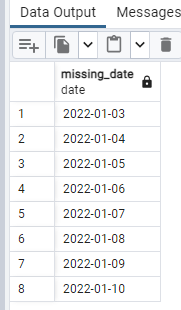
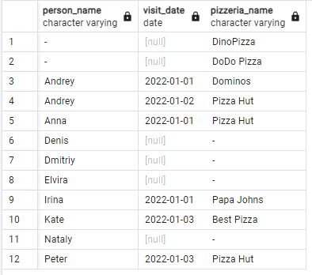
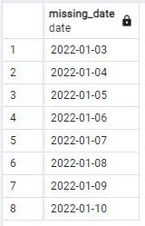
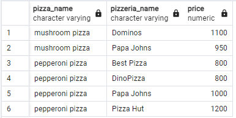
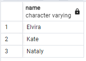
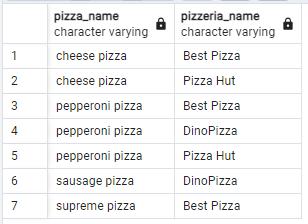
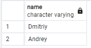
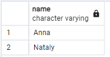
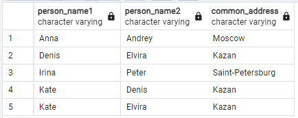

# Day 02 - Piscine SQL


## Exercise 00 - Move to the LEFT, move to the RIGHT

task:
Please write a SQL statement which returns a list of pizzerias names with corresponding rating value which have not been visited by persons. 

```

SELECT p.name, p.rating
FROM pizzeria p
LEFT JOIN person_visits pv ON p.id = pv.pizzeria_id
WHERE pv.id IS NULL;

```


## Chapter V
## Exercise 01 - Find data gaps                                                                                   |

task:
Please write a SQL statement which returns the missing days from 1st to 10th of January 2022 (including all days) for visits  of persons with identifiers 1 or 2 (it means days missed by both). Please order by visiting days in ascending mode. The sample of data with column name is presented below.

```

SELECT gs::date AS missing_date
FROM generate_series('2022-01-01', '2022-01-10', INTERVAL '1 day') gs
LEFT JOIN person_visits pv ON gs::date = pv.visit_date AND pv.person_id IN (1, 2)
WHERE pv.id IS NULL
ORDER BY missing_date;

```


## Chapter VI
## Exercise 02 - FULL means ‘completely filled’

task:
Please write a SQL statement that returns a whole list of person names visited (or not visited) pizzerias during the period from 1st to 3rd of January 2022 from one side and the whole list of pizzeria names which have been visited (or not visited) from the other side. The data sample with needed column names is presented below. Please pay attention to the substitution value ‘-’ for `NULL` values in `person_name` and `pizzeria_name` columns. Please also add ordering for all 3 columns.

```

SELECT 
    COALESCE(p.name, '-') AS person_name,
    pv.visit_date,
    COALESCE(pz.name, '-') AS pizzeria_name
FROM (SELECT * FROM person_visits WHERE visit_date BETWEEN '2022-01-01' AND '2022-01-03') pv
FULL JOIN person p ON pv.person_id = p.id
FULL JOIN pizzeria pz ON pv.pizzeria_id = pz.id
ORDER BY person_name, visit_date, pizzeria_name;

```


## Chapter VII
## Exercise 03 - Reformat to CTE

task:
Let’s return back to Exercise #01, please rewrite your SQL by using the CTE (Common Table Expression) pattern. Please move into the CTE part of your "day generator". The result should be similar like in Exercise #01

```

WITH date_series AS (
    SELECT generate_series('2022-01-01', '2022-01-10', INTERVAL '1 day')::date AS missing_date
)
SELECT ds.missing_date
FROM date_series ds
LEFT JOIN person_visits pv ON ds.missing_date = pv.visit_date AND pv.person_id IN (1, 2)
WHERE pv.id IS NULL
ORDER BY ds.missing_date;

```


## Chapter VIII
## Exercise 04 - Find favourite pizzas

task:
Find full information about all possible pizzeria names and prices to get mushroom or pepperoni pizzas. Please sort the result by pizza name and pizzeria name then. The result of sample data is below (please use the same column names in your SQL statement).

```

SELECT m.pizza_name, pz.name AS pizzeria_name, m.price
FROM menu m
JOIN pizzeria pz ON m.pizzeria_id = pz.id
WHERE m.pizza_name IN ('mushroom pizza', 'pepperoni pizza')
ORDER BY pizza_name, pizzeria_name;

```


## Chapter IX
## Exercise 05 - Investigate Person Data
                                                                                            
tasl:
Find names of all female persons older than 25 and order the result by name. The sample of output is presented below.

```

SELECT name
FROM person
WHERE gender = 'female' AND age > 25
ORDER BY name;

```


## Chapter X
## Exercise 06 - favourite pizzas for Denis and Anna

task:
Please find all pizza names (and corresponding pizzeria names using `menu` table) that Denis or Anna ordered. Sort a result by both columns. The sample of output is presented below.

```

SELECT m.pizza_name, pz.name AS pizzeria_name
FROM person_order po
JOIN person p ON po.person_id = p.id
JOIN menu m ON po.menu_id = m.id
JOIN pizzeria pz ON m.pizzeria_id = pz.id
WHERE p.name IN ('Denis', 'Anna')
ORDER BY m.pizza_name, pz.name;

```


## Chapter XI
## Exercise 07 - Cheapest pizzeria for Dmitriy

task:
Please find the name of pizzeria Dmitriy visited on January 8, 2022 and could eat pizza for less than 800 rubles.

```

SELECT DISTINCT pz.name
FROM person_visits pv
JOIN person p ON pv.person_id = p.id
JOIN pizzeria pz ON pv.pizzeria_id = pz.id
JOIN menu m ON pz.id = m.pizzeria_id
WHERE p.name = 'Dmitriy' 
  AND pv.visit_date = '2022-01-08'
  AND m.price < 800;

```


## Chapter XII
## Exercise 08 - Continuing to research data

task:
Please find the names of all males from Moscow or Samara cities who orders either pepperoni or mushroom pizzas (or both) . Please order the result by person name in descending mode. The sample of output is presented below.

```

SELECT DISTINCT p.name
FROM person p
JOIN person_order po ON p.id = po.person_id
JOIN menu m ON po.menu_id = m.id
WHERE p.gender = 'male'
  AND p.address IN ('Moscow', 'Samara')
  AND m.pizza_name IN ('pepperoni pizza', 'mushroom pizza')
ORDER BY p.name DESC;

```


## Chapter XIII
## Exercise 09 - Who loves cheese and pepperoni?

task:
Please find the names of all females who ordered both pepperoni and cheese pizzas (at any time and in any pizzerias). Make sure that the result is ordered by person name. The sample of data is presented below.

```

SELECT p.name
FROM person p
JOIN person_order po ON p.id = po.person_id
JOIN menu m ON po.menu_id = m.id
WHERE p.gender = 'female' AND m.pizza_name IN ('cheese pizza', 'pepperoni pizza')
GROUP BY p.name
HAVING COUNT(DISTINCT m.pizza_name) = 2
ORDER BY p.name;

```


## Chapter XIV
## Exercise 10 - Find persons from one city

task:
Please find the names of persons who live on the same address. Make sure that the result is ordered by 1st person, 2nd person's name and common address. The  data sample is presented below. Please make sure your column names are corresponding column names below.

```

SELECT 
    p1.name AS person_name1, 
    p2.name AS person_name2, 
    p1.address AS common_address
FROM person p1
JOIN person p2 ON p1.address = p2.address AND p1.id < p2.id
ORDER BY person_name1, person_name2, common_address;

```
