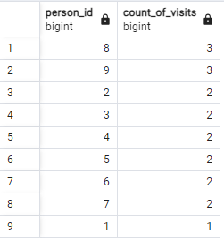
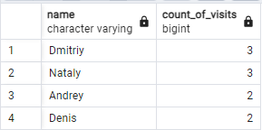
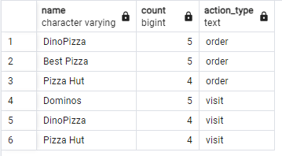
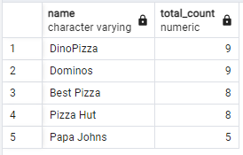
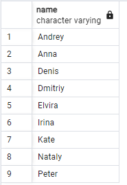
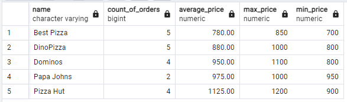
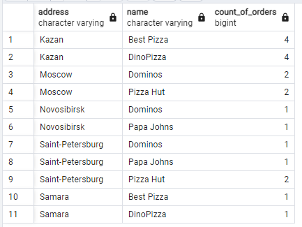
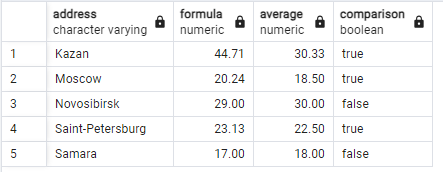

## Day03

### exercise 00

task:

Let’s make a simple aggregation, please write a SQL statement that returns person identifiers and corresponding number of visits in any pizzerias and sorting by count of visits in descending mode and sorting in `person_id` in ascending mode. Please take a look at the sample of data below.

```

SELECT person_id,
    COUNT(*) AS count_of_visits
FROM person_visits
GROUP BY person_id
ORDER BY count_of_visits DESC, person_id ASC;

```



### exercise 01

task:

Please change a SQL statement from Exercise 00 and return a person name (not identifier). Additional clause is  we need to see only top-4 persons with maximal visits in any pizzerias and sorted by a person name. Please take a look at the example of output data below.

```

SELECT p.name,
    COUNT(v.person_id) AS count_of_visits
FROM person_visits v
JOIN person p ON v.person_id = p.id
GROUP BY p.name
ORDER BY count_of_visits DESC, p.name ASC
LIMIT 4;

```



### exercise 02

task:

Please write a SQL statement to see 3 favorite restaurants by visits and by orders in one list (please add an action_type column with values ‘order’ or ‘visit’, it depends on data from the corresponding table). Please take a look at the sample of data below. The result should be sorted by action_type column in ascending mode and by count column in descending mode.

```

(
    SELECT pz.name, COUNT(*) AS count, 'order' AS action_type
    FROM person_order po
    JOIN menu m ON m.id = po.menu_id
    JOIN pizzeria pz ON pz.id = m.pizzeria_id
    GROUP BY pz.name
    ORDER BY count DESC
    LIMIT 3
)
UNION ALL
(
    SELECT pz.name, COUNT(*) AS count, 'visit' AS action_type
    FROM person_visits pv
    JOIN pizzeria pz ON pz.id = pv.pizzeria_id
    GROUP BY pz.name
    ORDER BY count DESC
    LIMIT 3
)
ORDER BY action_type, count DESC;

```



### exercise 03

task:

Please write a SQL statement to see restaurants are grouping by visits and by orders and joined with each other by using restaurant name.  
You can use internal SQLs from Exercise 02 (restaurants by visits and by orders) without limitations of amount of rows.


```

SELECT name, SUM(total_count) AS total_count
FROM (
    SELECT pz.name, COUNT(*) AS total_count
    FROM person_order po
    JOIN menu m ON m.id = po.menu_id
    JOIN pizzeria pz ON pz.id = m.pizzeria_id
    GROUP BY pz.name
    UNION ALL
    SELECT pz.name, COUNT(*) AS total_count
    FROM person_visits pv
    JOIN pizzeria pz ON pz.id = pv.pizzeria_id
    GROUP BY pz.name
) AS combined
GROUP BY name
ORDER BY total_count DESC, name ASC;

```



### exercise 04

task:


```

SELECT p.name, COUNT(*) AS count_of_visits
FROM person_visits pv
JOIN person p ON p.id = pv.person_id
GROUP BY p.name
HAVING COUNT(*) > 3;

```


### exercise 05

task:

Please write a SQL statement that returns the person name and corresponding number of visits in any pizzerias if the person has visited more than 3 times (> 3).Please take a look at the sample of data below.

| name | count_of_visits |
| ------ | ------ |
| Dmitriy | 4 |

```


```



### exercise 06

task:

Please find all pizza names (and corresponding pizzeria names using `menu` table) that Denis or Anna ordered. Sort a result by both columns. The sample of output is presented below.

```

SELECT m.pizza_name, pz.name AS pizzeria_name
FROM person_order po
JOIN menu m ON po.menu_id = m.id
JOIN pizzeria pz ON m.pizzeria_id = pz.id
JOIN person p ON po.person_id = p.id
WHERE p.name IN ('Denis', 'Anna')
ORDER BY m.pizza_name, pz.name;

```



### exercise 07

task:

Please find the name of pizzeria Dmitriy visited on January 8, 2022 and could eat pizza for less than 800 rubles.

```

SELECT pz.name
FROM person_visits pv
JOIN pizzeria pz ON pv.pizzeria_id = pz.id
JOIN menu m ON pz.id = m.pizzeria_id
JOIN person p ON pv.person_id = p.id
WHERE p.name = 'Dmitriy' AND pv.visit_date = '2022-01-08' AND m.price < 800;

```


### exercise 08

task:

Please find the names of all males from Moscow or Samara cities who orders either pepperoni or mushroom pizzas (or both) . Please order the result by person name in descending mode. The sample of output is presented below.

```

SELECT p.name
FROM person p
JOIN person_order po ON p.id = po.person_id
JOIN menu m ON po.menu_id = m.id
WHERE p.gender = 'male' AND p.address IN ('Moscow', 'Samara') AND m.pizza_name IN ('pepperoni pizza', 'mushroom pizza')
ORDER BY p.name DESC;

```



### exercise 09

task:

Please find the names of all females who ordered both pepperoni and cheese pizzas (at any time and in any pizzerias). Make sure that the result is ordered by person name. The sample of data is presented below.

```

SELECT p.name
FROM person p
JOIN person_order po ON p.id = po.person_id
JOIN menu m ON po.menu_id = m.id
WHERE p.gender = 'female' AND m.pizza_name IN ('cheese pizza', 'pepperoni pizza')
GROUP BY p.name
HAVING COUNT(DISTINCT m.pizza_name) = 2
ORDER BY p.name;

```



